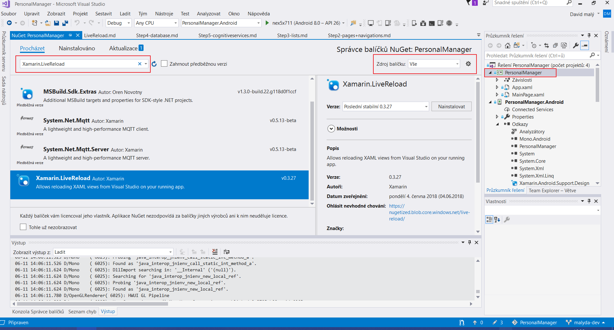
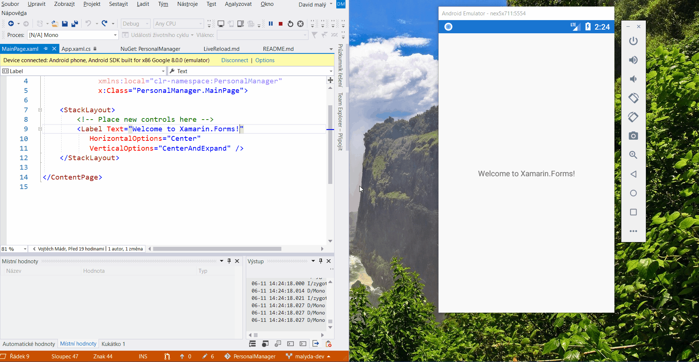

# Optional step - Xamarin Live Reload (Preview)

If you want to use new Xamarin feature called Xamarin Live Reload, here are steps you should follow:

First requirements:
1) __Visual Studio 2017 version 15.7__ or above with the Mobile development with .NET (Xamarin development)  
2) Xamarin Forms __3.0__ or above installed in project shared code (.NET standard or Shared)
3) Emulator or real device on same Wifi network

## How-to install and use
1) Download and install Visual Studio extension - [Xamarin Live Reload](https://marketplace.visualstudio.com/items?itemName=Xamarin.XamarinLiveReload)
2) Add Xamarin.LiveReload Nuget to your shared project (.Net standard or Shared)



> Nuget package is needed only in your shared application project for example in .NET standard library

3) Run *LiveReload.Init()* in your App
```csharp
public partial class App : Application
{
	public App ()
	{
        #if DEBUG
        LiveReload.Init();
        #endif

        InitializeComponent();
        MainPage = new MainPage();
	}
...
}
```
4) Run application and if your device and Visual Studio are connected you should see something like this:



> After installation you will see some warnings in Errors Window, it's because of LiveReload is in Preview and it needs little bit more time to fix everything.

Full tutorial you can find on [Xamarin Live Reload](https://docs.microsoft.com/en-us/xamarin/xamarin-forms/xaml/live-reload)
