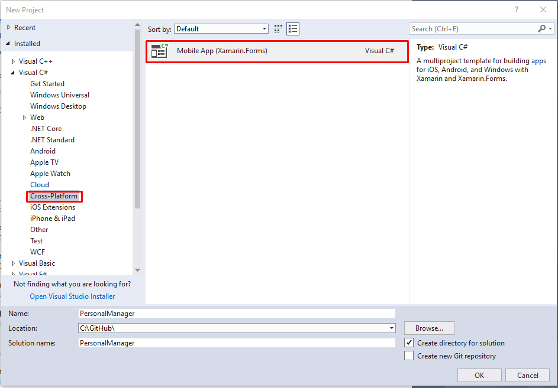
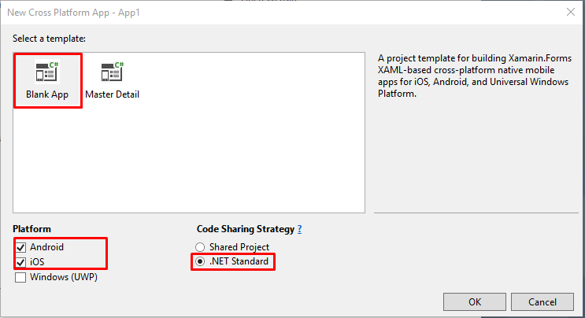
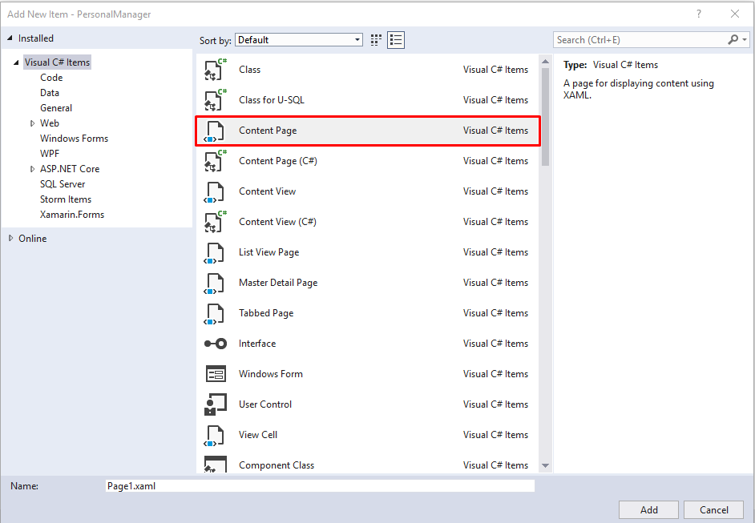
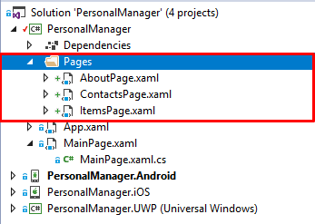
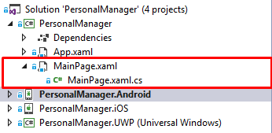
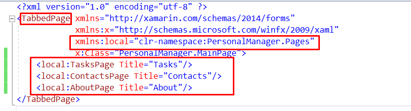
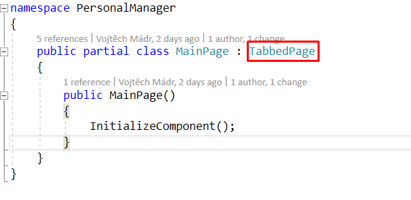
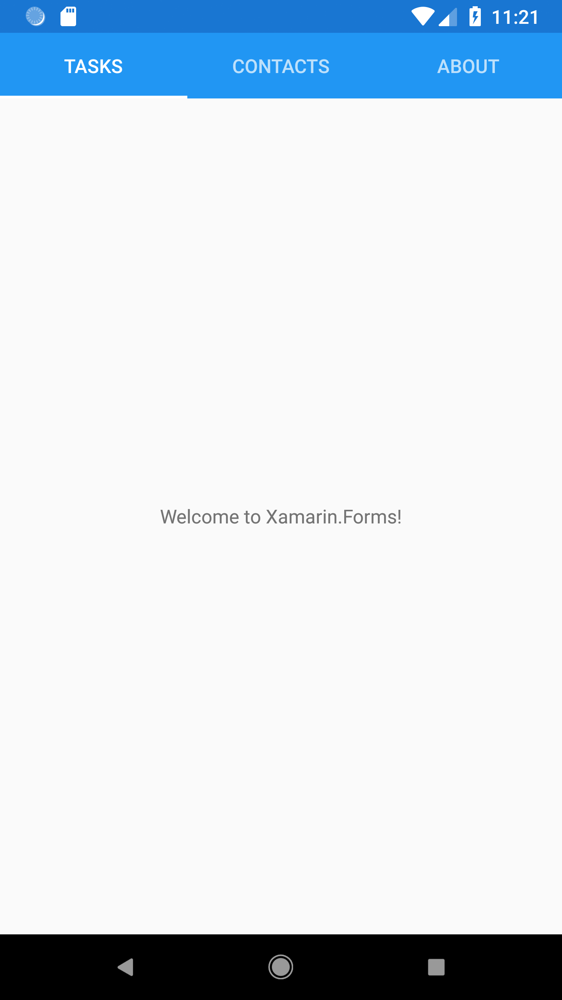

# Personal manager workshop (Part 1)


## 1. Create Project & Select Xamarin



* Visual Studio -> File -> New -> Project

## 2. Select CrossPlatforms Settings
* Prefered Xamarin Forms & .NET Standard (Version 2.0)




## 3. Create new Pages

* Create folder Pages
* Add 3 pages to folder (TasksPage, ContactsPage, AboutPage)



* Pages -> Add -> New Item -> ContentPage (Not C#!)




## 4. Update MainPage to TabbedPage

### Part 1

* Open MainPage.xaml screen



* Change ContentPage to TappedPage
* Remove ContentPage content
* Add TappedPage screens
* Add Namespace to:
```
xmlns:local="clr-namespace:PersonalManager.Pages"
```


### Part 2

* Open MainPage.xaml.cs 
* Change Content page to TappedPage




## 5. Start the app

