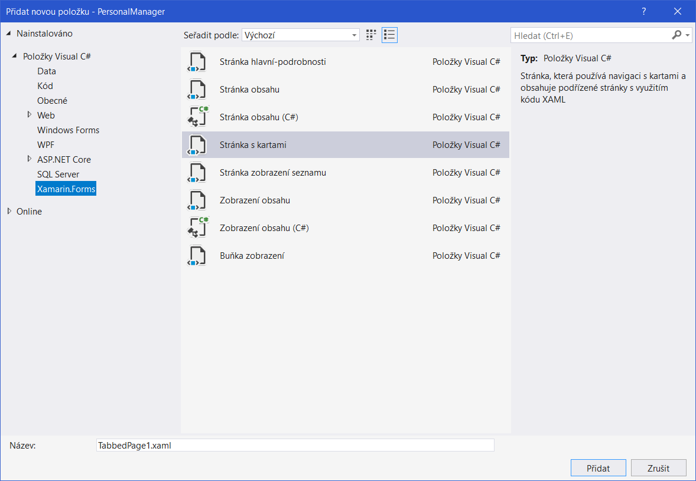
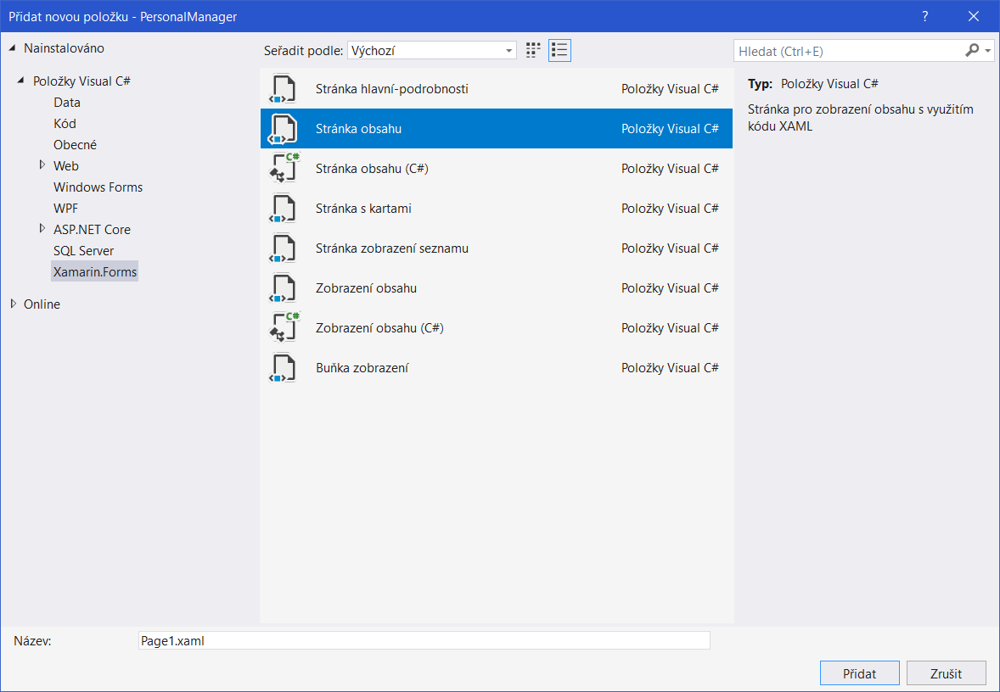

#  Personal manager workshop (Part 2)

## Tabbed Page
First we will create tabbed page, where we will store all our pages.

All you have to do is:

1) Add new Item to Solution - Tabbed Page (Str�nka s kartami in Czech)



I this new page you will see something like this:
```xml
<?xml version="1.0" encoding="utf-8" ?>
<TabbedPage xmlns="http://xamarin.com/schemas/2014/forms"
             xmlns:x="http://schemas.microsoft.com/winfx/2009/xaml"
             x:Class="PersonalManager.TabbedPage1">
  <!--Pages can be added as references or inline-->
  <ContentPage Title="Tab 1" />
  <ContentPage Title="Tab 2" />
  <ContentPage Title="Tab 3" />
</TabbedPage>
```
**TasksPage**, **ContactsPage** and **AboutPage** are pages which we will add now.

## Rest of pages
Create new page with: Add new item -  Xamarin Forms Page (xaml)



Create three pages with names:
1) TasksPage
2) ContactsPage
3) AboutPage

Then add their references to your Tabbed Page, so final Tabbed Page will look like this:
```xml
<?xml version="1.0" encoding="utf-8" ?>
<TabbedPage xmlns="http://xamarin.com/schemas/2014/forms"
            xmlns:x="http://schemas.microsoft.com/winfx/2009/xaml"
            xmlns:local="clr-namespace:PersonalManager.Pages"
            x:Class="PersonalManager.MainPage">
    <local:TasksPage Title="Tasks"/>
    <local:ContactsPage Title="Contacts"/>
    <local:AboutPage Title="About"/>
</TabbedPage>
```

2) Update About Page 

```xml
<StackLayout Margin="20">
            <Label Text="This application is part of workshop for mDevCamp!" HorizontalOptions="Center"/>
            <Label Text="Created by Vojtěch Mádr!" HorizontalOptions="Center"/>
        </StackLayout>
```

3) Update Task Page

* XML

```xml
 <AbsoluteLayout HorizontalOptions="Fill" VerticalOptions="Fill">
        <ListView x:Name="TasksListView" AbsoluteLayout.LayoutFlags="All" AbsoluteLayout.LayoutBounds="0, 0, 1, 1">
        </ListView>
        <views:FloatingActionButtonView x:Name="FloatingButton" Clicked="Button_Clicked" AbsoluteLayout.LayoutFlags="PositionProportional" AbsoluteLayout.LayoutBounds="1, 1, AutoSize, AutoSize" ButtonColor="Blue" ImageName="add"/>
    </AbsoluteLayout>
```

* Code Behind

```csharp
public TasksPage()
{
	InitializeComponent();
	List<string> tasks = new List<string>();
	tasks.Add("Create Xamarin Apps");
	tasks.Add("Join XMDG.cz on Facebook and Twitter");
	tasks.Add("Enjoy Xamarin Prague Days");

    QuickTaskListView.ItemsSource = tasks;
}

```

