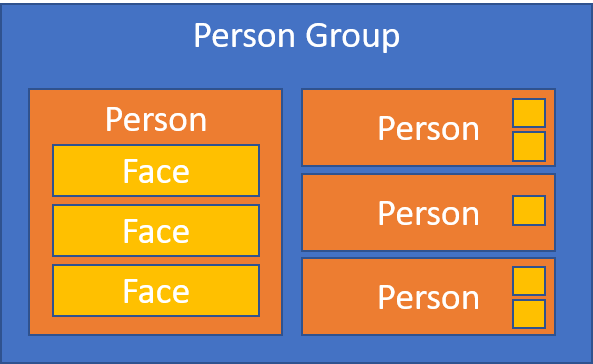
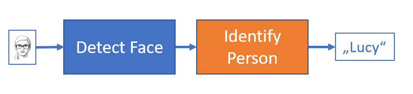

# Personal manager workshop (Part 5) - Cognitive Services

We will use Microsoft Cognitive Services [Face API](https://azure.microsoft.com/en-us/services/cognitive-services/face/) to provide our app with smart functionality. At the end it will be able to recognize person on a photo and automatically select particular contact.

## Face API

The process of people identification using Cognitive Services is as follows:

1. Create a person group.
2. Add new person to this group.
3. Add faces to this person.
4. Train the group.



This teaches the model, who are the people you want to recognize and how they look.

Then you can send new faces and ask "who is this?"

1. Send an image to the Detect API.
2. If face detected, send it to the Identify API.
3. Get information about the recognized person.



## Workshop API

Cognitive Services is a set of REST APIs provided by Microsoft and like any other cloud API it requires you to provide key with each call.

* In production you would register new Face API resource in [Microsoft Azure](https://azure.microsoft.com) and get the key from there.
* For testing you can get a free account here: https://azure.microsoft.com/en-us/services/cognitive-services/.
* **But for this workshop, we have already prepared keys and API proxy for you.**

You can explore Swagger (Open API) definition of the Workshop API here: https://mdevcampws.azurewebsites.net/swagger/index.html

Every call to the Workshop API must contain the `MS-Face-Key` HTTP header with your key as value.

Methods you will use:

* `/api/group` 
  * create new Person Group
* `/api/group/[id]/person`
  * create new Person in group [id]
* `/api/group/[id]/person/[id]/faces`
  * add face to person [id] in group [id]
  * expects photo encoded as Base64 URL string
* `/api/group/[id]/train`
  * train person group [id]
* `/api/group/[id]/identify`
  * identify who is on the picutre
  * expects photo encoded as Base64 URL string

> Notes:
>
> * All of the endpoints accept POST requests.
> * Request content-type should be `application/json`.
> * Remember to include the `MS-Face-Key` header.

## REST examples

Create person group:

```
POST https://mdevcampws.azurewebsites.net/api/group

Content-Type: application/json
MS-Face-Key: ABCDEF

"mojeskupina"
```

Create person:

```
POST https://mdevcampws.azurewebsites.net/api/group/mojeskupina/person

Content-Type: application/json
MS-Face-Key: ABCDEF

"P00001"
```

Add face to a person:

```
POST https://mdevcampws.azurewebsites.net/api/group/mojeskupina/person/P00001/faces

Content-Type: application/json
MS-Face-Key: ABCDEF

"AAAAAAAAAAAAAAAAAAAAAAAAAAAAAAAAAAAAAAAAA...AAA=="
```

Train group:

```
POST https://mdevcampws.azurewebsites.net/api/group/mojeskupina/train

MS-Face-Key: ABCDEF
```

Identify person on a picture:

```
POST https://mdevcampws.azurewebsites.net/api/group/mojeskupina/identify

Content-Type: application/json
MS-Face-Key: ABCDEF

"AAAAAAAAAAAAAAAAAAAAAAAAAAAAAAAAAAAAAAAAA...AAA=="
```

## Face Browser

If you want to see what's actually stored on the server, as part of the Cognitive Services Face API backend, you can use Face Trainer, created by Hao Luo: https://face.lifeishao.com/ (all running client-side, no information stored on his server).